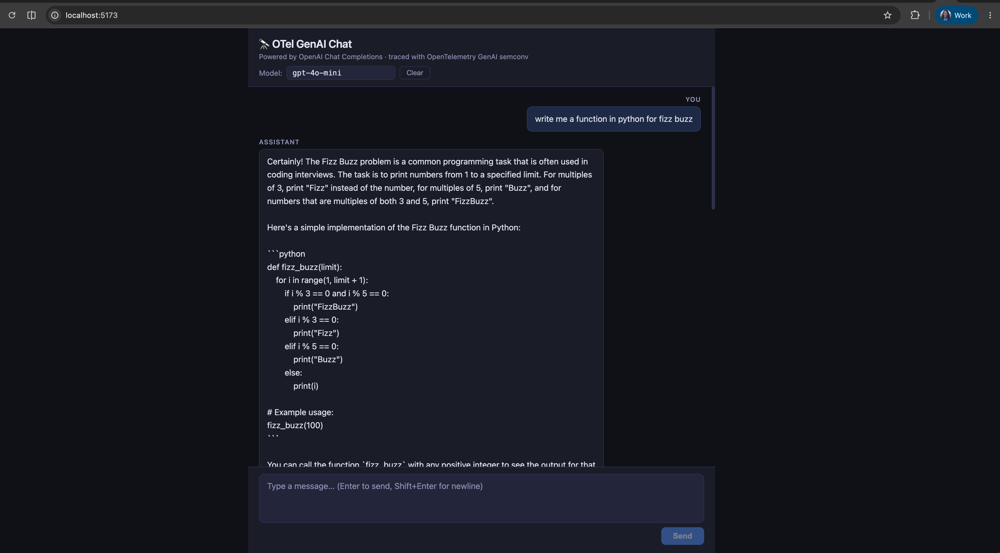
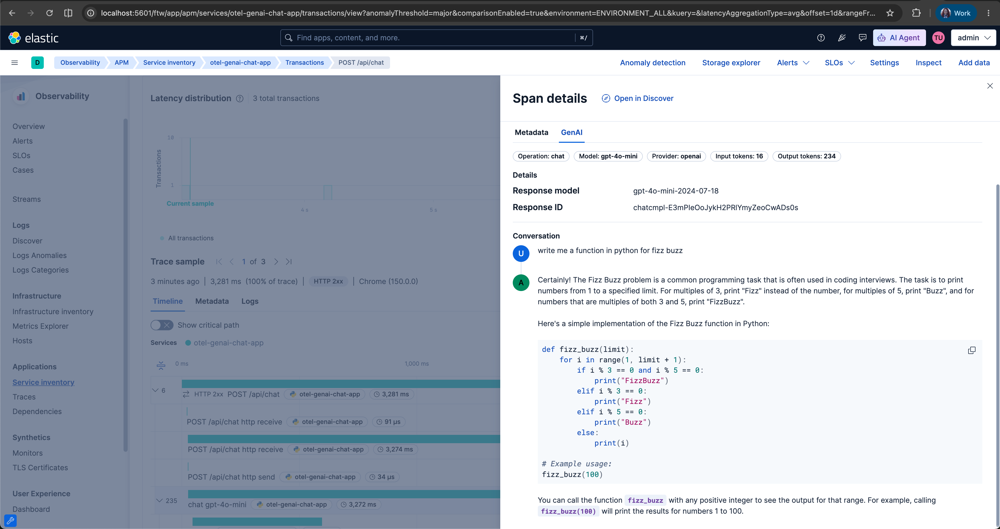

# otel-genai-chat-app

A minimal chat application for exploring **OpenTelemetry GenAI semantic conventions** with the OpenAI SDK and Kibana APM.

| Layer | Technology |
|---|---|
| Backend | Python 3.10+ · FastAPI · streaming SSE |
| Frontend | React 19 · TypeScript · Vite |
| Instrumentation | `opentelemetry-instrumentation-openai-v2` (vanilla) **or** EDOT Python |
| Local telemetry sink | **EDOT Collector** → Elasticsearch / Kibana APM |
| Cloud telemetry sink | Elastic Cloud managed OTLP endpoint (no collector needed) |

Every chat request automatically produces — without touching application code:
- `gen_ai.*` spans (model, token usage, request/response attributes per the [GenAI semconv](https://opentelemetry.io/docs/specs/semconv/gen-ai/))
- HTTP server spans for the FastAPI endpoint
- Optional prompt/response content as OTel log events (`OTEL_INSTRUMENTATION_GENAI_CAPTURE_MESSAGE_CONTENT`)
- Pre-aggregated APM metrics (`service_transaction`, service map) via the `elasticapm` connector

---

## Architecture

```
Browser (React + TypeScript)
  │  POST /api/chat  (SSE stream)
  ▼
FastAPI backend ──── openai.chat.completions.create(stream=True) ──► LLM API
  │
  │  OTLP/HTTP  :4318  (zero-code auto-instrumentation)
  ▼
EDOT Collector  ─── elasticapm processor + connector
  │                      └─ generates service_transaction metrics for APM UI
  ├── traces-generic.otel-*   (gen_ai.* as dotted names, not labels.*)
  ├── metrics-*.otel-*        (token usage, latency histograms, APM aggregates)
  └── logs-generic.otel-*     (span events with message content)
         ▼
     Elasticsearch → Kibana APM
```

### Why EDOT Collector, not APM Server?

APM Server always ECS-translates OTLP data: `gen_ai.system` becomes `labels.gen_ai_system` (underscores, buried in `labels.*`). That's not the OTel-native format.

The **EDOT Collector** (Elastic Distribution of OpenTelemetry Collector) is the self-managed equivalent of the Elastic Cloud managed OTLP endpoint:
- Stores everything in `traces-generic.otel-*` with **`attributes.gen_ai.*` dotted names preserved**
- The built-in `elasticapm` connector generates `service_transaction` metrics → service appears in Kibana APM Service Inventory with throughput and latency charts
- No APM Server required

---

## Quick-start

### 1. Clone & configure

```bash
git clone https://github.com/jennypavlova/otel-genai-chat-app.git
cd otel-genai-chat-app
cp .env.example .env
```

Edit `.env` — minimum required:

```bash
OPENAI_API_KEY=sk-...          # your OpenAI-compatible API key
OPENAI_MODEL=gpt-4o-mini       # any model your provider supports

# Local EDOT Collector path (default):
OTEL_EXPORTER_OTLP_ENDPOINT=http://localhost:4318
ELASTIC_ES_ENDPOINT=http://host.docker.internal:9200
ELASTIC_ES_USER=elastic
ELASTIC_ES_PASSWORD=changeme
```

> **Never commit `.env` to git.** It is gitignored. All secrets go there only.

### 2. Start the EDOT Collector

Requires Docker and a locally running Elasticsearch + Kibana.

```bash
make collector-up
# Starts the EDOT Collector on :4318 (HTTP) and :4317 (gRPC)
```

### 3. Set up the backend

```bash
make setup-edot      # creates backend/.venv-edot  (recommended)
make setup-vanilla   # creates backend/.venv-vanilla (for comparison)
```

### 4. Run the backend

```bash
make run-edot        # EDOT Python — OTel-native + Elastic-enriched APM data
# or
make run-vanilla     # vanilla upstream OTel instrumentation
```

Backend starts on **http://localhost:8000**.

### 5. Run the frontend

```bash
make setup-frontend  # npm install
make run-frontend    # Vite dev server on http://localhost:5173
```

Open **http://localhost:5173** and start chatting.

---

## Testing the telemetry

### Basic test

Send a chat message and wait ~10 seconds (EDOT Collector batch timeout) then check Kibana APM.





> **Note:** The GenAI tab in Kibana APM (operation, model, provider, token counts, conversation view) is work in progress — see [elastic/kibana#279277](https://github.com/elastic/kibana/pull/279277).

### Multi-turn conversation test

The most interesting traces come from multi-turn conversations — each user/assistant turn is captured as a span event on the `gen_ai.*` span, so you can see the full conversation history per request:

1. Send a first message: `"Tell me about vector databases in 2 sentences"`
2. Follow up: `"Which one has the most GitHub stars?"`
3. Follow up again: `"Compare Milvus vs Qdrant on write performance"`

In Kibana APM each **POST /api/chat** request becomes a trace. Open the waterfall for the third request and inspect the `gen_ai.*` span — the `gen_ai.input.messages` attribute will contain all three turns of context sent to the model.

### What to look for in Kibana

1. **Kibana → Observability → APM → Services** — find `otel-genai-chat-app` (environment: `development`)
2. Click the service → **Transactions** → select a `POST /api/chat` transaction
3. Open the trace waterfall. You will see:
   - HTTP server span (`POST /api/chat`) at the root
   - Child `chat openai` span for the OpenAI call
4. Click the `chat openai` span → **Span details** tab:

| Attribute | What you see |
|---|---|
| `gen_ai.provider.name` | `openai` |
| `gen_ai.request.model` | `gpt-4o-mini` |
| `gen_ai.response.model` | actual model version returned |
| `gen_ai.usage.input_tokens` | prompt token count |
| `gen_ai.usage.output_tokens` | completion token count |
| `gen_ai.input.messages` | full conversation history sent (JSON) |
| `gen_ai.output.messages` | assistant response (JSON) |

> These appear as **`attributes.gen_ai.*`** in OTel-native format (dotted names), not `labels.gen_ai_*`.

5. In **Span events** (when `OTEL_INSTRUMENTATION_GENAI_CAPTURE_MESSAGE_CONTENT=SPAN_AND_EVENT`):
   - `gen_ai.choice` events — one per response message
   - `gen_ai.user.message`, `gen_ai.system.message` events — one per input turn

### Verify OTel-native storage in Elasticsearch

```bash
# Confirm traces land in traces-generic.otel-* (not traces-apm-*)
curl -s "http://localhost:9200/traces-generic.otel-*/_search" \
  -u elastic:changeme \
  -H "Content-Type: application/json" \
  -d '{
    "size": 1,
    "query": {"term": {"service.name": "otel-genai-chat-app"}},
    "sort": [{"@timestamp": "desc"}],
    "_source": ["attributes.gen_ai*", "data_stream"]
  }' | python3 -m json.tool
```

You should see `attributes.gen_ai.operation.name`, `attributes.gen_ai.provider.name` etc. — **not** `labels.gen_ai_*`.

---

## Telemetry export paths

### Path A — Local EDOT Collector (default)

The EDOT Collector runs locally via docker-compose and replicates what the Elastic Cloud managed OTLP endpoint does:

```
App → EDOT Collector (:4318) → Elasticsearch
         └── elasticapm connector generates service_transaction metrics
```

Required `.env` variables:
```bash
OTEL_EXPORTER_OTLP_ENDPOINT=http://localhost:4318
ELASTIC_ES_ENDPOINT=http://host.docker.internal:9200
ELASTIC_ES_USER=elastic
ELASTIC_ES_PASSWORD=changeme
# or use API key:
# ELASTIC_ES_API_KEY=your-api-key-here
```

Start: `make collector-up`

### Path B — Elastic Cloud managed OTLP (no collector)

Point the SDK directly at the Elastic Cloud managed OTLP endpoint. No local collector or APM Server required.

```bash
OTEL_EXPORTER_OTLP_ENDPOINT=https://<cluster>.apm.<region>.aws.found.io
OTEL_EXPORTER_OTLP_HEADERS=Authorization=ApiKey <your-elastic-api-key>
```

The Cloud endpoint stores data identically to Path A — `traces-generic.otel-*`, `attributes.gen_ai.*` dotted names, same Kibana APM experience.

---

## Vanilla OTel vs EDOT — what's different?

| | Vanilla (`make run-vanilla`) | EDOT (`make run-edot`) |
|---|---|---|
| Package | `opentelemetry-distro` + `opentelemetry-instrumentation-openai-v2` | `elastic-opentelemetry` |
| GenAI semconv spans | `gen_ai.*` attributes | `gen_ai.*` + Elastic enrichment |
| Kibana APM transaction names | Basic URL pattern | Richer names |
| Service maps | Partial | Full (Elastic agent metadata) |
| `agent.name` in APM | `opentelemetry/python` | `opentelemetry/python/elastic` |

Run both and compare in **Kibana APM → Services → otel-genai-chat-app**.

---

## Configuration reference

All settings live in `.env` (gitignored). See `.env.example` for full details.

| Variable | Description | Default |
|---|---|---|
| `OPENAI_API_KEY` | API key for your LLM provider | — |
| `OPENAI_BASE_URL` | Base URL (blank = OpenAI default; LiteLLM: `http://localhost:4000/v1`) | blank |
| `OPENAI_MODEL` | Model name | `gpt-4o-mini` |
| `OTEL_SERVICE_NAME` | Service name in APM | `otel-genai-chat-app` |
| `OTEL_DEPLOYMENT_ENVIRONMENT` | Environment label in APM filter | `development` |
| `OTEL_EXPORTER_OTLP_ENDPOINT` | OTLP export destination | `http://localhost:4318` |
| `OTEL_EXPORTER_OTLP_HEADERS` | Auth headers for Cloud | blank |
| `OTEL_EXPORTER_OTLP_PROTOCOL` | Exporter protocol | `http/protobuf` |
| `OTEL_RESOURCE_ATTRIBUTES` | Extra resource attributes | `telemetry.distro.name=elastic` |
| `OTEL_SEMCONV_STABILITY_OPT_IN` | Enable latest GenAI semconv | `gen_ai_latest_experimental` |
| `OTEL_INSTRUMENTATION_GENAI_CAPTURE_MESSAGE_CONTENT` | Capture prompt/response (`NO_CONTENT` / `SPAN_AND_EVENT` / `EVENT_ONLY` / `SPAN_ONLY`) | `SPAN_AND_EVENT` |
| `ELASTIC_ES_ENDPOINT` | Elasticsearch URL for EDOT Collector | `http://host.docker.internal:9200` |
| `ELASTIC_ES_USER` | Elasticsearch username | `elastic` |
| `ELASTIC_ES_PASSWORD` | Elasticsearch password | — |
| `ELASTIC_ES_API_KEY` | Elasticsearch API key (alternative to user/password) | — |

---

## EDOT Collector config

`edot-collector-config.yaml` — key design decisions:

```yaml
processors:
  elasticapm: {}           # enriches spans with Elastic APM attributes

connectors:
  elasticapm: {}           # generates service_transaction + span metrics from traces

exporters:
  elasticsearch/otel:
    mapping:
      mode: otel           # writes to traces-generic.otel-* (NOT traces-apm-*)
```

The `elasticapm` component appears in **two roles**: as a `processor` (enrichment, in the traces pipeline) and as a `connector` (metric generation, bridging the traces and metrics pipelines). Both are needed for full APM UI support.

---

## LiteLLM compatibility

Works with any OpenAI-compatible gateway:

```bash
# Start LiteLLM
litellm --model ollama/llama3.2 --port 4000

# In .env:
OPENAI_BASE_URL=http://localhost:4000/v1
OPENAI_API_KEY=any-string
OPENAI_MODEL=ollama/llama3.2
```

---

## Development notes

- **Two virtualenvs** (`backend/.venv-vanilla`, `backend/.venv-edot`) keep the two OTel distros cleanly separated.
- **No OTel code in the app** — all instrumentation is injected by `opentelemetry-instrument` at process start. Zero-code auto-instrumentation is the whole point.
- The Vite dev server proxies `/api` → `http://localhost:8000`, so no CORS configuration is needed in development.
- **Batch timeout**: the EDOT Collector flushes every 5 seconds — wait at least that long after sending a message before checking Kibana or querying Elasticsearch.

---

## Useful links

- [OpenTelemetry GenAI semantic conventions](https://opentelemetry.io/docs/specs/semconv/gen-ai/)
- [`opentelemetry-instrumentation-openai-v2`](https://pypi.org/project/opentelemetry-instrumentation-openai-v2/)
- [EDOT Python (elastic-opentelemetry)](https://www.elastic.co/docs/reference/opentelemetry/edot-sdks/python/setup)
- [EDOT Collector](https://www.elastic.co/docs/reference/edot-collector)
- [Elastic APM connector](https://www.elastic.co/docs/reference/edot-collector/components/elasticapmconnector)
- [Elastic Cloud managed OTLP quickstart](https://www.elastic.co/docs/solutions/observability/get-started/quickstart-elastic-cloud-otel-endpoint)
- [OTel data streams vs classic APM](https://www.elastic.co/docs/reference/opentelemetry/compatibility/data-streams)
